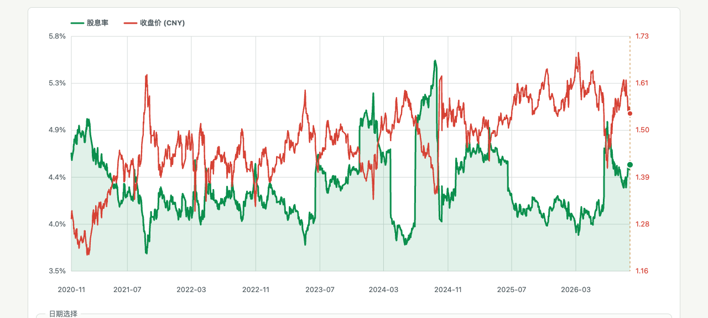
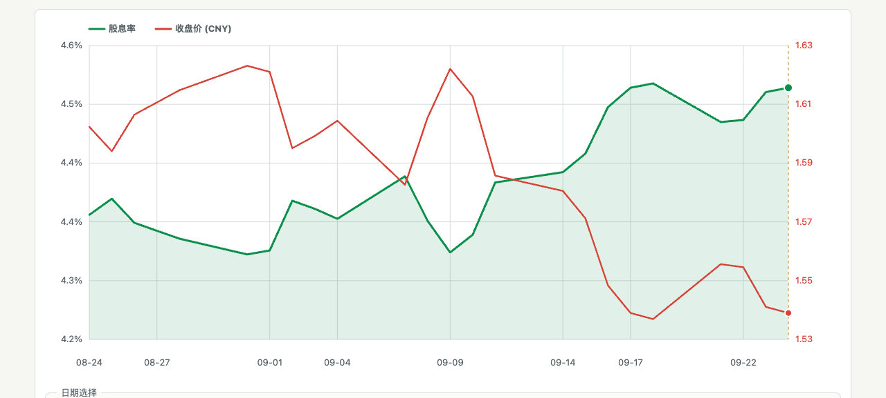

# 515080价格跳变核验 — 2026-09-27

## 一、本次背景与范围

- 用户反馈中证红利价格曲线存在多处跳变，要求先查数据，再查其他原因。
- 主审计类型：数据准确性；同时核验数据新鲜度、前端坐标和绘图行为。
- 本次开始时工作区干净；本地和Quant线上均为`9aea8d7`（v0.7.3）。nginx运行正常，浏览器未见JavaScript错误。
- 本次仅增加审计报告及证据，不改应用代码、线上行情或计算口径，也不修改Data_Server。
- 核验时间：2026-09-27 10:05—10:10 CST。可复核机器结果见[核验摘要](515080价格核验摘要.json)。

## 二、结论

**当前图上价格没有发现错值、错序或绘图错位。** 1414个已显示交易日，腾讯、新浪、东方财富三方收盘价一致。跳变由实际行情与除息组成，自动纵轴缩放、逐日直线连接和多年数据密度进一步强化了视觉锯齿。

全下载历史另有5日出现源间0.001元差异，均在当前图表起点之前，不能据此认定全部历史源完全一致；详见第六节。

## 三、数据链路及独立复核

链路：Data_Server未复权日线（缺口时以已登记工单的腾讯`day`源补足）→Python逐日结果CSV→nginx静态文件→前端按日期将真实收盘价映射至右轴。

| 核验 | 范围/结果 |
| --- | --- |
| 线上CSV | 2019-12-27至2026-09-24，1636行、1636个唯一日期，严格升序 |
| Data_Server `market=SH&adjustment=raw` | 1635日，至2026-09-23；与网站重叠日期全部一致，仅缺2026-09-24 |
| 腾讯`day`隔离重新抓取 | 分年度抓取、间隔10秒；1636日全部一致；重算18条官方分红及折算TTM，所有逐日结果一致 |
| 新浪日K独立复核 | 1636日全覆盖，收盘价差异0 |
| 东方财富`fqt=0`独立复核 | 1636日全覆盖；1631日一致，5日差0.001元，全部发生于2020年8月 |
| 页面实际显示区间 | 2020-11-30至2026-09-24，1414日；三家行情收盘价全部一致 |
| SVG反算数据 | 1414个价格点，反算价格最大误差2.22e-16元；日期横坐标最大误差0像素，无日期回折 |
| 基础验证 | 36项已有测试通过；`node --check app.js`通过；线上浏览器无JS错误 |

Data_Server与腾讯为同源，不能将两者视为独立行情证据；独立校验另外使用了新浪与东方财富。

来源端点：

- [线上逐日CSV](https://03466-dividend.cw-info.top/runtime-data/515080_ttm_dividend_yield_daily.csv)
- Data_Server `/v1/cn-equity-quotes?symbol=515080&market=SH&adjustment=raw`，分90日查询，饱和时使用已有二分逻辑。
- [腾讯历史日线](https://web.ifzq.gtimg.cn/appstock/app/fqkline/get?param=sh515080,day,2026-01-01,2026-09-24,1000,)，只读取`data.sh515080.day`。
- [新浪历史日线](https://money.finance.sina.com.cn/quotes_service/api/json_v2.php/CN_MarketData.getKLineData?symbol=sh515080&scale=240&ma=no&datalen=1970)。
- [东方财富未复权日线](https://push2his.eastmoney.com/api/qt/stock/kline/get?secid=1.515080&klt=101&fqt=0&beg=20191227&end=20260924&lmt=10000&fields1=f1,f2,f3,f4,f5,f6&fields2=f51,f52,f53,f54,f55,f56,f57,f58,f59,f60,f61)，读取每行日期与收盘价；响应代码515080。

## 四、跳变的具体原因

### 1. 未复权收盘价保留了真实除息缺口

股息率分母按项目规则必须使用未复权收盘价。现金分红从基金资产中支付，除息后价格的直接比较会包含现金分派影响。

| 除息日 | 前一收盘价 | 当日收盘价 | 每份现金分红 | 纯价格涨跌 | 当日价格加现金后的变化 |
| --- | ---: | ---: | ---: | ---: | ---: |
| 2024-03-28 | 1.491 | 1.476 | 0.015 | -1.0060% | 约0.0000% |
| 2026-06-18 | 1.537 | 1.488 | 0.020 | -3.1880% | -1.8868% |
| 2026-09-16 | 1.572 | 1.550 | 0.015 | -1.3995% | -0.4453% |

最后一列计算`(当日收盘价+本次现金分红)/前一收盘价-1`，用于拆解当天现金分派影响，未考虑税费，也不是前复权价格字段。9月16日0.022元的价格降幅中，0.015元来自当次现金分派的机械影响；另有市场价格变化，不能将所有下跌归因于除息。

分红来自Data_Server的招商官网公告记录，18条；[招商官方产品页](https://www.cmfchina.com/web/fundDetail/515080/index.html)的分红记录金额一致。该页还显示9月24日基金净值1.5403，网站展示的是交易收盘1.541，两者并未混用。

### 2. 部分大幅波动是市场真实成交变化

- 2024-09-30：1.502→1.620，+7.8562%。
- 2024-10-09：1.631→1.500，-8.0319%。
- 2025-04-07：1.525→1.427，-6.4262%。

以上日期腾讯、新浪、东方财富未复权收盘价完全一致，不是同日多源拼接、重复点、复权混用或取错净值。此处只证实价格，不从涨跌倒推某个新闻事件的因果关系。

### 3. 纵轴自动缩放会让小额变化显得很陡

`app.js`的`paddedRange()`按所选区间最低/最高值加8%边距，价格使用独立右轴（约第540—556行）。

- 全区间右轴约1.1632—1.7258元，图内高度426像素，0.01元相当于约7.57像素。
- 近1月（8月24日—9月24日）右轴缩到约1.53236—1.62864元，同样426像素高，0.01元相当于约44.25像素，视觉放大约5.84倍。
- 绿色股息率与红色价格分别使用左右轴，线条斜率不能直接比较幅度大小；近1月左轴仅保留1位小数，还会出现重复刻度标签，这是精度展示问题，不改变价格点。

### 4. 逐交易日直线连接与多年压缩产生锯齿

价格SVG只使用`M`、`L`指令，未做曲线插值、移动平均或降采样；每一个顶点都来自真实日收盘价。

全历史1414个日线点压在约1010像素的绘图区内，平均每点只有0.714像素。真实的日间上下波动会显得密集、尖锐。自然日横轴保留周末/假期距离，所以相邻交易日的横向间距可能不同，这不是缺数据或乱序。

## 五、新鲜度与更新任务

- 线上数据生成时间2026-09-25 18:06:54 CST；行情截止2026-09-24。
- 上交所[中秋/国庆休市公告](https://big5.sse.com.cn/site/cht/www.sse.com.cn/disclosure/announcement/general/c/c_20260915_10832273.shtml)明确9月25日至27日休市、9月28日恢复，因此9月24日为本次检查时的最近交易日。
- Quant更新日志确认9月24日、25日两次515080任务均成功；旧日志中的03466冲突不是本次515080跳跃原因。
- 515080工单`522b0258-c618-4ba0-b6e2-4a411d0f5d35`仍为`approved`，未声称完成；9月24日仍由带标记的腾讯临时源补齐，且与新浪/东方财富当日1.541元相符。

## 六、额外发现及尚未消除的不确定性

### A. 上市初期5日存在0.001元的源间分歧

| 日期 | 网站/腾讯/新浪 | 东方财富未复权 |
| --- | ---: | ---: |
| 2020-08-21 | 1.239 | 1.240 |
| 2020-08-24 | 1.249 | 1.250 |
| 2020-08-25 | 1.246 | 1.247 |
| 2020-08-26 | 1.230 | 1.231 |
| 2020-08-27 | 1.234 | 1.235 |

最大相对差约0.0813%。缺少交易所原始日终成交记录，不能仅以多数源相同来判定哪方正确。本次保留现有值，没有静默选值或改数据。5日均在当前图表起点之前，不解释图上跳变；扩展上市起完整价格视图前，应核验这5日。

### B. “全部”价格图实际上未显示首次除息前的222个交易日

前端约第786行同时要求价格、股息和股息率均非空，导致2019-12-27至2020-11-27的价格虽然在CSV中存在，却随空股息率一起被过滤。当前价格图起点为2020-11-30。

分类：展示覆盖缺口。它不造成已显示曲线跳变；后续可将价格序列和股息率空值分开处理，使价格从上市日显示、首次除息前仅股息率留空。

## 七、建议的展示改进

1. 价格明确标为“未复权收盘价”，在除息日增加标记/浮窗说明，帮助解释现金分派缺口。
2. 提供较宽或固定价格轴选项，并说明左右轴独立，降低小额变化被放大的错觉。
3. 增加可选20交易日均线或独立的含分红总回报趋势视图，用于观察长期趋势；股息率分母继续使用真实未复权收盘价。复权趋势必须单独标明口径，不能替代原始报价。
4. 分离首次除息前的价格与空股息率；提升短区间轴刻度精度，避免重复文字。

本次用户要求为核验与原因分析，以上展示改进未实施。应用版本保持v0.7.3。

## 八、审计反思

- 数据正确性与曲线观感需要分别核验；先检查真实价格，再检查复权/分红口径、坐标跨度、点密度和插值方式。
- Data_Server和原始采集源可能同源，必须额外找独立报价，不能把同源一致当作交叉验证。
- 直接反算SVG顶点能区分“数据错误”和“视觉缩放”，比只看截图更可靠。
- 同一图上的空值过滤会隐藏本来有效的另一序列，后续UI检查应同时看原始行数与实际绘图点数。
- 本次未修改审计skill或全局记忆，仅在项目内沉淀证据。
